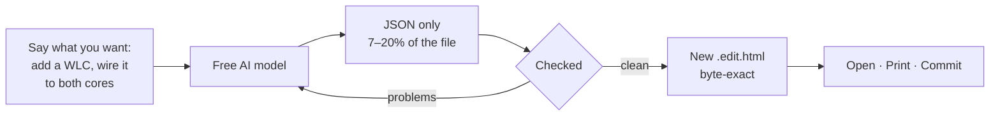

# Network Design HTML

**Network diagrams you can edit by asking. One HTML file. No installs.**

[](https://github.com/cloudbatsx/network-design-html/actions/workflows/validate.yml)
[](LICENSE)


Your topology, rack elevation, and design notes live in **one HTML file** that opens
in any browser, prints to a clean PDF, and diffs properly in Git.

You change it by describing what you want. A **free** AI model is enough, because it
never sees the HTML — only a small block of data.

> **New here, or new to network design?** Read [`start-here.html`](start-here.html) —
> a self-contained, step-by-step visual guide from nothing to a finished document.

## Download

Everything is in one ZIP — the ten starter kits, the blank template, the AI
editing helper, the packager, the official artwork and the beginner guide, ready
to use offline with no installs:

**[⬇ Download the latest release](https://github.com/cloudbatsx/network-design-html/releases/latest)** —
or clone the repository, which is the same thing plus history.
> Open it from your clone or download it; like everything else here, it works offline.

---

## How it works



The AI never touches the drawing code, the symbols, or the styling. Everything
outside the data block is copied through **byte for byte**.

---

## Quick start

No Node. No npm. No command line. Just a browser and an AI chat window.

1. **Download** the [release ZIP](https://github.com/cloudbatsx/network-design-html/releases/latest) — or just two files: the [blank template](starters/network-design-template.edit.html) and [`edit-with-ai.html`](edit-with-ai.html)
2. **Open `edit-with-ai.html`** — it sits at the top of the download — and press **Start a new design** (the blank template is built in), or open any design you already made. A progress rail walks you through the rest
3. **Building?** Step 2 becomes a build screen: **Copy the build prompt** — one click, you type nothing. Starting from a picture of your network? One button above it has your AI read the picture first. **Editing?** Step 2 is the edit screen instead: pick the part — devices, connections, the rack — say the change in plain English, and **Copy prompt**
4. **Paste the reply back** → click **Check it** → set your **branding** (name, colours, a PNG logo — no AI involved)
5. **Save new design file** → double-click it. Done. The **Package** step appears under Save: one click on the `assets` folder and your file gets the official Cisco artwork — anything missing keeps its drawn artwork

> **Step 3 is why a free model can drive this.** Ask for the devices and the AI
> writes back ~3 KB instead of the whole 39 KB design — 80–90% less to produce, so
> it stops running out of room mid-reply, and a rewiring job can't quietly reword
> your findings. Your part is merged back in, then the **whole** design is checked.

> **Step 4 is the important one.** If the AI got something wrong, you get plain
> English — *"access-sw-01 and edge-fw-02 both occupy U38"* — plus a ready-made
> sentence to paste straight back to the AI.

<details>
<summary><b>No helper tool? Do it by hand.</b></summary>

<br>

1. Open the template in a plain text editor
2. Find `<!-- PROOF-DATA:BEGIN -->` and `<!-- PROOF-DATA:END -->`
3. Copy the JSON between them (not the `<script>` lines)
4. Paste it into the prompt from [`docs/ai-json-rules.md`](docs/ai-json-rules.md)
5. Paste the reply back over the old JSON, save, reopen

**Three things that will bite you:**

- Save as **UTF-8**, never ANSI — the file contains `·` and `—`
- Use a **plain text editor**. Never Word
- Change **nothing** outside those two marker lines

</details>

---

## Two ways to finish

A design is **already finished** when you save it. It draws with 19 built-in vector
symbols, carries no images, and needs no download, no install and no network. That
is the light path, and for most documents it is the better one:

| | file size | needs |
|---|---|---|
| **Vector symbols** — just save it | **~180–240 KB** | nothing |
| **Official Cisco artwork** — run the packager | ~4 MB | the `assets` folder |

Over 20× smaller, emails cleanly, diffs in Git, prints identically. The symbols live in
[`symbols/`](tools/symbols/README.md), they are MIT licensed original work, and you are
free to lift them for anything else you build — see
[`tools/symbols/vector-symbol-showcase.html`](tools/symbols/vector-symbol-showcase.html) for
all 19 at a glance.

**The rack is drawn the same way.** 26 faceplates — switches, routers, firewalls,
servers, patch panels, PDUs, a UPS — front and rear, at true EIA-310 proportions,
so a 48-port switch reads as a 48-port switch and an SFP28 bank does not look like
copper. 18 are vendor-neutral; the rest reproduce the port layout that makes
a Cisco, Juniper, Palo Alto, Fortinet or Arista box recognisable, without any
branding. Name one in the equipment schedule:

```json
{ "id": "core-sw-01", "position": 38, "height": 1, "asset": "cisco-nexus-48sfp-1u" }
```

No download and no packaging step — see [`rack-faces/`](tools/rack-faces/README.md) for
the full list and [`tools/rack-faces/rack-face-preview.html`](tools/rack-faces/rack-face-preview.html)
to browse them.

Nothing is one-way, either: a packaged file carries its editable source inside it,
so **Download editable source** hands the light version straight back.

## Official artwork

When a document does need the **official Cisco icons and rack faces** — a customer
deliverable, a house standard — swap them in at the end:

- **In the helper:** the **Package** step appears after every save, with your design
  already loaded — choose the `assets` folder once per session, press build.
- **Standalone**, for a file someone sent you: open [`packager.html`](packager.html),
  point it at the **`assets`** folder, choose the design file → **Build portable HTML**.

Out comes one file with the real images inside it. Still offline, still no install,
still openable anywhere — and it can hand your editable source back at any time.

The artwork ships in this repository, so a clone has everything the packager needs:

```text
assets/icons/cisco-pms3015/   294 official Cisco topology icons
assets/rack-assets/            10 front/rear rack faces
```

**Your own artwork works too.** Drop your images into the packager, or keep them in
the `assets` folders, and reference them by exact filename:

```json
{ "id": "core-sw-01", "icon": "core-switch", "iconAsset": "asset:cisco/acme-9500.jpg" }
```

`iconAsset` overrides one device's picture without touching anything else. Filenames
are case-sensitive, and a `.jpg` is expected for topology icons, a `.png` for rack
faces. Anything the design asks for and you have not supplied is listed by name —
and **kept as its built-in drawn artwork** in the result, because a partial package
is a valid package. Nothing fails silently, and nothing missing vetoes a build.

---

## What you get

| | |
|---|---|
| 🖥️ **Logical topology** | Zones, devices, and links from a JSON block. Click any device to inspect it. |
| 🗄️ **Rack elevation** | Front and rear from one equipment schedule, so they can't drift apart. 26 drawn faceplates ship built in — no artwork needed. |
| ✂️ **Part-based editing** | The helper sends the AI one part — devices, connections, the rack — so a free model writes 80–90% less and stops getting cut off. |
| ✅ **It checks itself** | Catches rack overlaps, dangling links, duplicate IDs, unknown icons and kinds, face-height mismatches, broken JSON — loudly, in the file itself. |
| 🖨️ **Prints properly** | Letter-size PDF with the sidebar dropped, printing exactly the layers you have on screen. |
| 📐 **Two drawing styles** | The helper's Style panel converts a finished drawing between a clean grid and an engineering sheet — subnet bars, cable lanes, side captions — deterministically, no AI and no quota. Each option says up front what it would do; what can't convert honestly is left alone and named. |
| 🔎 **Engineering review** | After every check, the helper looks at the drawing like a network engineer: trust zones, the defended edge, exposed servers, redundancy, a management story. Observations, never errors — each hands you the question that settles it, or one click records the absence as a gap. |
| 🎨 **Your branding** | Name, colours and logo staged in the helper's Branding panel — the one edit no AI ever touches. |
| 🗂️ **Sections you choose** | Leave out identity, change, operations or the equipment appendix; the document renumbers itself and the printed PDF follows. The overview, the figure and the gaps list never leave — they carry the checks and the honesty. |
| 🧾 **Version control built in** | Every save of an edit bumps the revision and adds a dated row to the change record, summarised from your own request — no AI involved, and never in the filename. A fresh build's first save is dated, not bumped. |
| 📦 **Zero dependencies** | No CDN, no fonts, no build step, no server. Works on a plane. |

## Starter kits

Don't start from a blank page. Copy the one closest to your network.

| Kit | Shape | Size |
|---|---|---|
| [**Branch site**](starters/NET-BR-001.edit.html) | One WAN edge, one firewall, one switch, wireless, 12U cabinet | 9 nodes — **start here** |
| [Regional hub](starters/NET-RH-001.edit.html) | Three diverse transports, an SD-WAN edge pair, a collapsed core, campus access and wireless, and a 24U rack with every unit accounted for | 18 nodes |
| [Enterprise edge, DMZ & services](starters/NET-ENT-001.edit.html) | Three zones with a DMZ hanging off the perimeter | 15 nodes |
| [The same edge, drawn with segment bars](starters/NET-ENT-002.edit.html) | One network, drawn the other way — shared subnet bars and junction circles instead of repeated point-to-point lines, and no rack on purpose | 19 objects |
| [Leaf-spine fabric](starters/NET-FAB-001.edit.html) | Non-hierarchical: every leaf to every spine, north-south via border leaf | 15 nodes |
| [**Industrial control network**](starters/NET-OT-001.edit.html) | Not an IT network at all: stacked by Purdue level, an industrial DMZ that brokers every crossing, cell/area **rings** instead of stars, and a safety system deliberately wired to nothing | 18 nodes |
| [Campus + rack](starters/NET-LAB-002.edit.html) | Two independent gateways, peer link, MLAG downstream | 17 nodes |
| [The same campus, unified reference](starters/NET-LAB-003.edit.html) | Dual provider handoffs, a cross-connected perimeter, and access, wireless and services all dual-homed to both cores — every drawn link carries the id of its record | 15 nodes |
| [**Headquarters**](starters/NET-HQ-001.edit.html) | Collapsed core, out-of-band zone, 22-device 42U rack | 20 nodes — **the next size up** |
| [HQ campus, engineered to the unit](starters/NET-HQ-002.edit.html) | Dual providers, StackWise Virtual core, three access floors, and a 42U rack scheduled to the unit with dual power feeds and an airflow record | 21 nodes |

> **Every kit supports AI editing of everything — drawings included.** The four
> richest starters — NET-ENT-002, NET-HQ-002, NET-LAB-003 and NET-RH-001 — were
> once hand-drawn engineering sheets; they have been regenerated through the
> shared coordinate engine, so their segment bars, routing lanes and caption
> sides are ordinary data records now. A sheet-edition copy from an old
> download is refused by `edit-with-ai.html` — re-download the current file.

**NET-ENT-001 and NET-ENT-002 are the same network.** They exist as a pair because
the drawing is a choice, not a consequence of the data: one spells out every link,
the other collapses shared networks onto a subnet bar. Open both and copy whichever
argues better to your reader.

Every kit is one self-contained file with no images, no fonts and no network calls.
Each one records **its own gaps** — because a document that renders perfectly while
hiding its own uncertainty is worse than no document.

### Gaps you can point at

A finding can name the device it's about:

```json
{ "title": "Firewall failover is unproven", "detail": "...", "at": "edge-fw-02" }
```

A numbered marker then appears on that device, and the number is the finding's
position in the list — so the drawing and the list can never disagree. Click the
marker to jump to the finding. `"atZone": "perimeter"` outlines a whole area instead.

One control hides the section, the markers, and every table row marked as an
assumption, together — and printing follows it, so you decide what a printed
deliverable contains. What keeps a document honest is not the printer: the gaps
list can never be empty, assumed rows stay marked, and the layer ships visible.

### It catches your mistakes

This is the part that isn't like other diagram tools. Visio and draw.io will happily
let you stack two 2U servers in the same rack slot forever. This won't:

```
FAIL · 2 data errors
access-sw-01 overlaps edge-fw-02 at U38.
Link 19 references a missing node.
```

---

## Make it yours

The layout is fixed so every document reads the same way. **The branding is not.**

```json
"brand": {
  "name": "Acme Networks",
  "label": "Network Engineering — Internal",
  "logoViewBox": "0 0 512 512",
  "logoPath": "M64 64h384v384h-384z"
}
```

Export your logo as SVG, paste its path `d` into `logoPath`, match the `viewBox`.
That's it — nothing else depends on it.

---

## Why HTML?

- **The source and the deliverable are the same file.** No export step.
- **Git tells you what changed.** Adding a switch is a readable diff, not a new binary.
- **It opens anywhere.** Attach it to a ticket. Email it. Archive it. It still works in five years.
- **Weak AI models can drive it.** The editable surface is data, not geometry.

### What this is *not*

Documentation tooling — not discovery, monitoring, or a source of truth. It won't poll
your network or replace NetBox. It makes *intentional* design documentation easy to
write, review, and keep honest.

There's also no auto-layout: node positions are coordinates you (or the AI) set. Fine
for the diagrams people actually hand-draw; not a substitute for Graphviz on 200 nodes.

---

## Documentation

| File | What it covers |
|---|---|
| [`docs/ai-json-rules.md`](docs/ai-json-rules.md) | The prompt. Copy it into your AI chat. |
| [`docs/document-shell.md`](docs/document-shell.md) | The layout standard — section spine, toggleable layers, print contract. |
| [`tools/symbols/README.md`](tools/symbols/README.md) | The 19 vector symbols — the semantic keys, retheming, reusing them elsewhere. |
| [`docs/architecture.md`](docs/architecture.md) | The packaging contract and symbol synchronization. |
| [`CONTRIBUTING.md`](.github/CONTRIBUTING.md) | Read before changing symbol geometry. |

<details>
<summary><b>For maintainers</b> — tests, the packager, repo layout</summary>

<br>

Run the validator before sharing a template change:

```bash
npm test
```

**The packager needs no build.** It is source in the tree, and it reads `assets/`
from the checkout when you open it. Nothing bakes artwork into it — that is asserted
by `npm test`, along with a byte ceiling, because a packager that has to be built is
a packager most people will never have.

**Optional example build.** To regenerate the packaged examples and the QA report:

```bash
npm run build:packager
npm run verify:packager
```

Those write into `dist/`, which stays Git-ignored: the outputs embed artwork and are
reproducible from the tree in one click anyway.

[`docs/template-authoring-rules.md`](docs/template-authoring-rules.md) is the
template-authoring and packaging contract — the rules for rewriting the template
itself, *not* the prompt for editing a diagram. It asks for a complete ~175 KB HTML
file back, so it needs a strong model; it was called `gemini-editing-rules.md`,
which pointed beginners at the one door a free model cannot open.

```text
starters/                ten ready-made designs to copy, plus the blank template
assets/                  official Cisco icons and rack faces
edit-with-ai.html        offline AI editing helper
packager.html            swaps in the official artwork — at the root, beside the helper
start-here.html          the beginner guide, also at the root
docs/                    prompt, layout standard, architecture, study notes
tests/                   contract fixture, behaviour tests, live free-model runs
tools/                   validation, builds, and the maintainer libraries:
tools/symbols/           canonical SVG sprite + semantic map + showcase
tools/rack-faces/        drawn faceplate library + review page
dist/                    build output, untracked
```

</details>

---

## Status and license

Pre-release. The workflow is complete, machine-checked on every commit — 37
repository checks plus a 124-test behaviour suite — and validated on both
paths. Fresh-build: one live session and twenty-two automated runs, each
building a complete document from a different diagram image with free Gemini,
every one reaching a clean save (source-fidelity auditing is ongoing).
Editing: the nine-run protocol matrix passed on 2026-08-17 — nine part-scoped
edits on the largest starter, each a clean save in one round trip, including
the whole-design diagnostic run. Protocol, results and the semantic audit live
in [`docs/free-model-results.md`](docs/free-model-results.md).

Code, tooling, documentation **and the 19 vector symbols** are **MIT licensed** —
see [`LICENSE`](LICENSE). The symbols are original work; reuse them anywhere.

⚠️ **One exclusion: `assets/`.** The Cisco topology icons and rack faces come from
third-party sources and ship here unmodified so the packager works from a clone.
The MIT grant does not extend to them, and this repository is not a licence to
redistribute them onward — read [`THIRD_PARTY_NOTICES.md`](THIRD_PARTY_NOTICES.md)
first. Delete `assets/` and everything still works; you simply design and ship with
the vector symbols instead.

Independent project. Not affiliated with or endorsed by Cisco.
